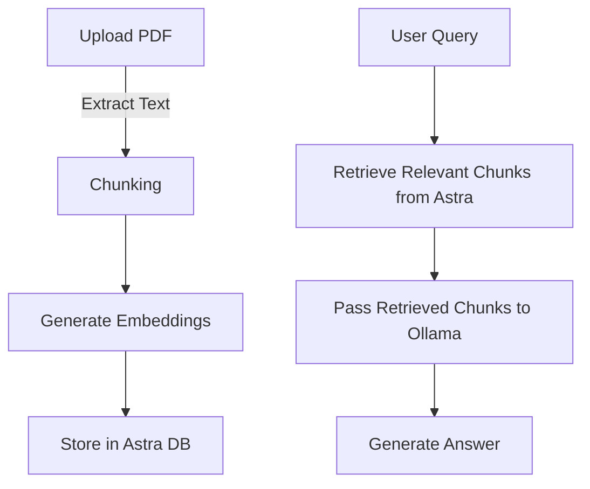

# 📚 RAG-based PDF Question-Answering System

This repository implements a **Retrieval-Augmented Generation (RAG) pipeline** for answering questions from **PDF documents** using **Astra DB (Vector Store), LangChain, and Ollama (LLM).**

## 🚀 Features
- **PDF Text Extraction**: Extracts text from uploaded PDFs.
- **Embeddings Generation**: Converts extracted text into embeddings using Hugging Face models.
- **Vector Store (Astra DB)**: Stores and retrieves relevant document chunks.
- **LLM (Ollama Integration)**: Uses Ollama to generate answers based on retrieved context.
- **Interactive Q&A Interface**: Accepts user queries and retrieves the best response.

---

## 🛠️ Installation

### 1️⃣ Install Dependencies
```bash
pip install -r requirements.txt
```

### 2️⃣ Set Up Astra DB (Vector Store)
- **Create an account on Astra DB**: [Astra DB](https://www.datastax.com/products/datastax-astra)
- **Get Database Credentials (Secure Connect Bundle)**
- **Store credentials in `.env` file**:
```env
ASTRA_DB_SECURE_CONNECT_PATH=path/to/secure-connect-database_name.zip
```

### 3️⃣ Run the Application
```bash
python app.py
```

---

## 🏗️ Architecture

1. **Text Extraction**: Parses PDFs and extracts text.
2. **Chunking**: Splits text into smaller segments.
3. **Embeddings Generation**: Converts text chunks into vector embeddings.
4. **Vector Store (Astra DB)**: Stores embeddings for similarity search.
5. **Retrieval**: Finds the most relevant chunks based on user queries.
6. **LLM Processing**: Ollama generates answers based on retrieved context.

### 🔹 Workflow Diagram


---

## 🔍 Usage

### 1️⃣ Upload a PDF
- Extracts text and stores it in Astra DB as embeddings.

### 2️⃣ Ask a Question
```python
query_text = "What is the main topic of the document?"
retrieved_chunks = vector_store.as_retriever().get_relevant_documents(query_text)
response = ollama_llm(query_text, retrieved_chunks)
print(response)
```

### 3️⃣ Retrieve Answers
- System searches for relevant text chunks and uses LLM to answer.

---

## 📦 Dependencies
- `langchain`
- `langchain-google-genai`
- `google-generativeai`
- `astra-db`
- `pypdf`
- `huggingface_hub`
- `dotenv`

---


### What is RAG?
RAG (**Retrieval-Augmented Generation**) combines **retrieval (vector search)** with **generation (LLMs)** to answer questions based on documents.

### Why Astra DB?
Astra DB is a **scalable vector store** optimized for fast retrieval.

### Can we use another LLM?
Yes, we can replace **Ollama** with OpenAI, Cohere, or any other model.


